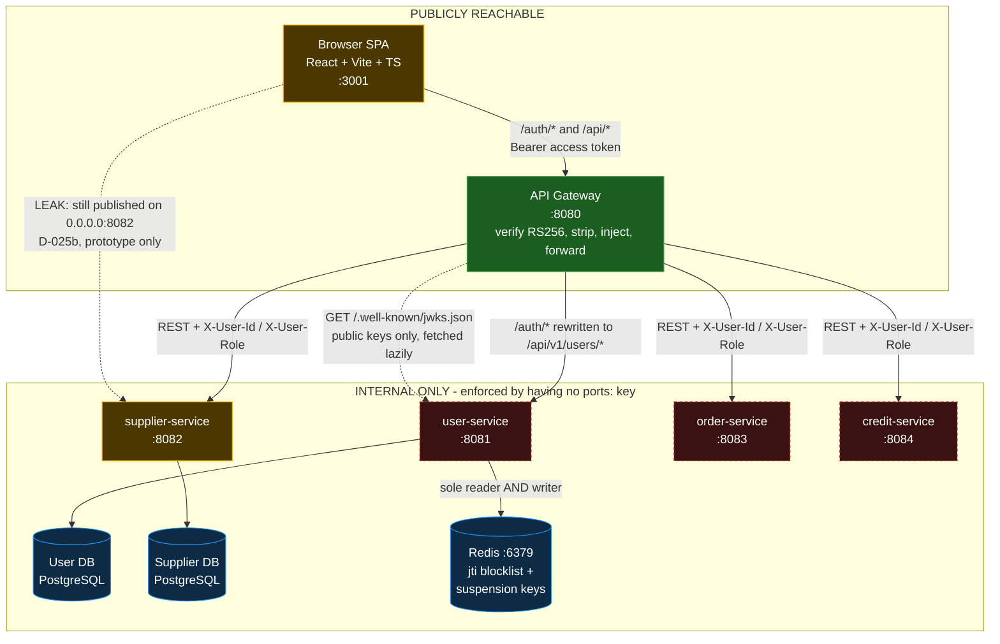
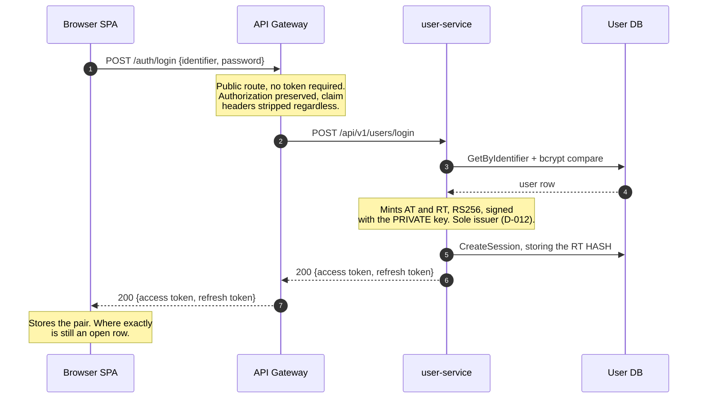
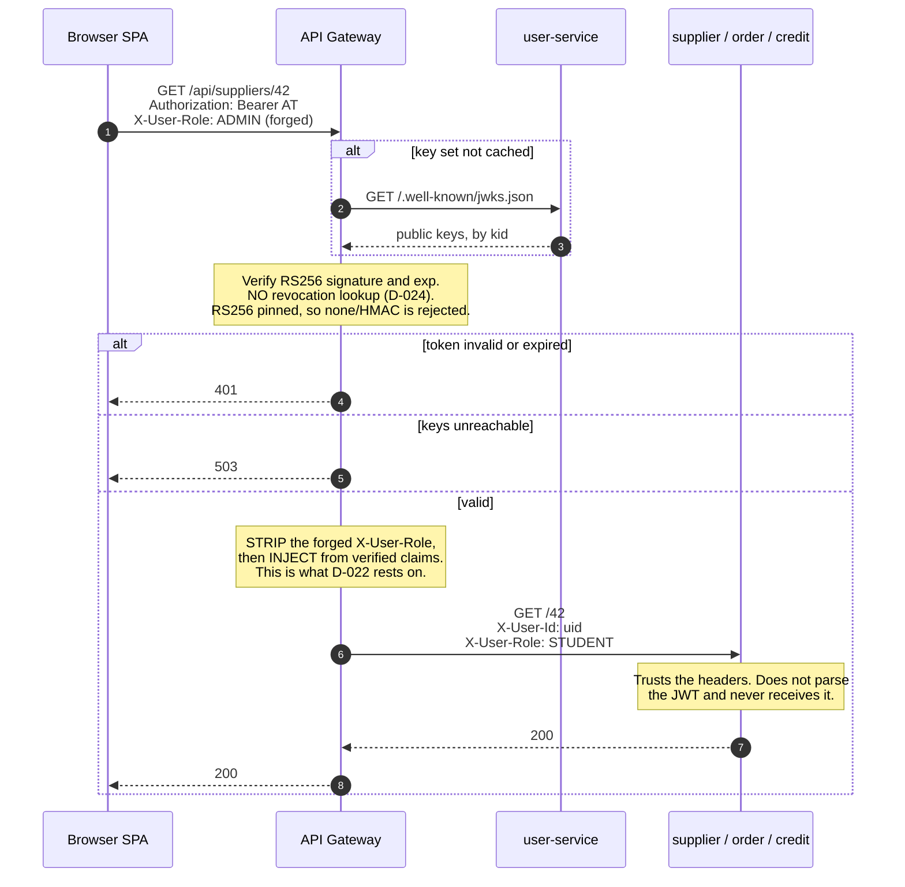
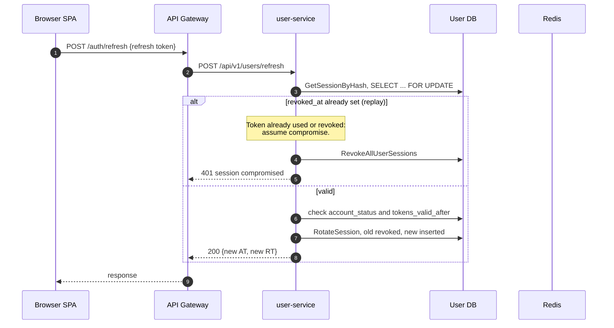
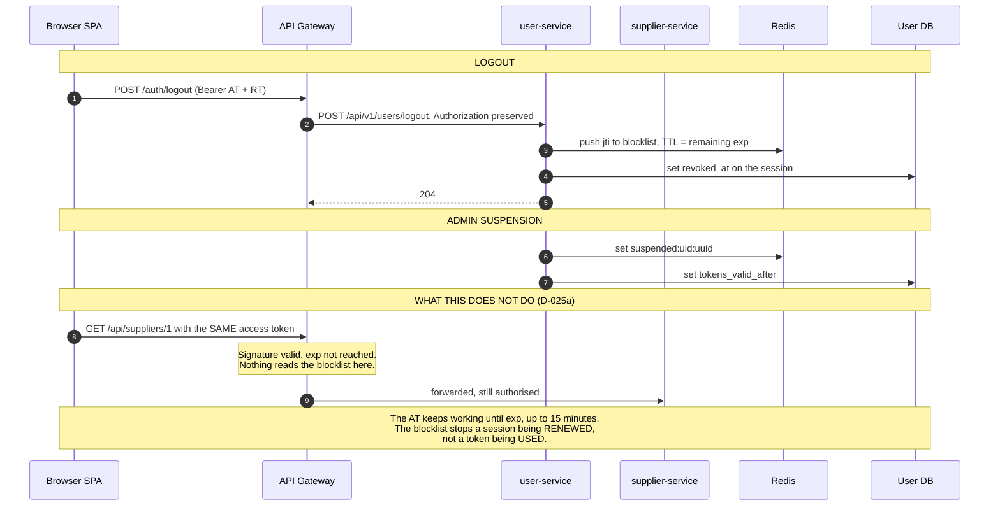
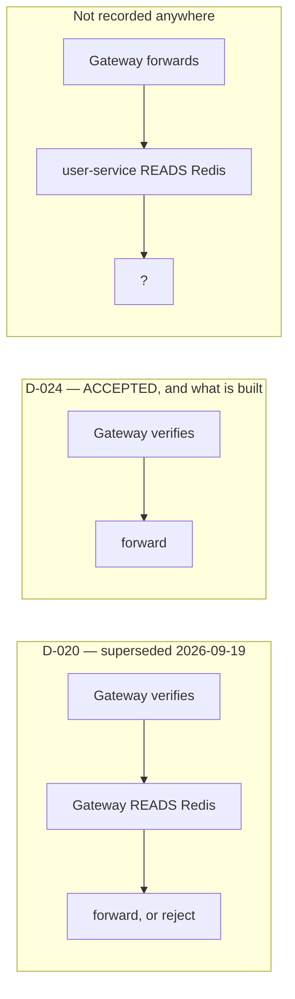

<!--
AI Assistance Disclosure:
Tool: Claude Code (model: Opus 5), date: 2026-09-19
Scope: Redrew the team's PNG architecture diagram as Mermaid and brought it in
  line with decisions D-019..D-028. Every element traces to a recorded row in
  ../decisions.md — no architecture was invented here, and no Rationale is
  offered.
  2026-09-22: corrected two errors (refresh read Postgres not Redis; the
  lingering-token arrow goes to supplier-service not user-service), added §6
  on who answers "is this token still good?", refreshed §7's state table.
Author review: Nigeltzy - The AI was use dto convert the team's original PNG diagram into mermaid for easier recording and updating on the repo.
-->

# FoC — Architecture

Supersedes [`jwt-token-architecture-diagram.png`](jwt-token-architecture-diagram.png)
as the current picture. **The PNG is kept deliberately**: it is what the team
drew on 2026-09-19 and what D-010–D-018 were transcribed from. It is now out of
date in two places, both flagged below.

Mermaid rather than an image so it renders on GitHub, diffs in review, and
cannot silently drift from the decisions it depicts.

Every box and arrow traces to a row in [`../decisions.md`](../decisions.md).
Where something is **not built yet**, the diagram says so rather than showing an
intention as though it were a system.

---

## 1. Trust zones and components

| Colour | Meaning | Components |
| --- | --- | --- |
| Green | Built and verified | `api-gateway` |
| Amber | Built, not yet integrated | Browser SPA (runs on fixtures), `supplier-service` (in PR #1, unmerged) |
| Red, dashed | Folder exists, no code | `user-service`, `order-service`, `credit-service` |

> **Changed from the PNG (1 of 2).** The original attached Redis to the API
> Gateway. **D-024 took the gateway out of Redis entirely** — `user-service` is
> now the only process that touches it, which is why the sole arrow into Redis
> comes from `user-service`.

---

## 2. Login and registration (D-012, D-015, D-023, D-027)

The gateway mints, inspects and stores nothing here. It rewrites the path and
passes the response back.

---

## 3. An authenticated request (D-013 as amended by D-024, plus D-022)

The forged `X-User-Role: ADMIN` arrives at the service as `STUDENT`.
`TestClientCannotEscalateViaHeader` exists to keep it that way.

---

## 4. Refresh (D-015)

**This is where revocation actually bites.** The gateway takes no part in the
decision; it only carries the request.

> **Corrected 2026-09-22.** This diagram previously showed `user-service`
> reading the Redis blocklist here. It does not. `RefreshService.activeAccount`
> reads `account_status` and `tokens_valid_after` from **PostgreSQL**, and the
> replay check above reads the session row. `user-service`'s Redis adapter is
> `RedisBlocklistWriter`, whose interface is `Set` only — there is no `Get`
> anywhere in the service. See §5.

---

## 5. Logout and suspension, and what D-025 costs

> **Changed from the PNG (2 of 2).** The original says logout makes the access
> token *"stop working before its exp"*. Under **D-024** it does not — nothing
> on the request path reads the blocklist. Accepted knowingly for the prototype
> and recorded as **D-025a**.

> **Added 2026-09-22.** Both writes above currently have **no reader anywhere**.
> The gateway does not read them (D-024), and `user-service` cannot — its Redis
> interface is `Set`-only. `jti:` and `suspended:uid:` are write-only today.
> That is the state D-024 left behind when it removed the reader D-020 had
> assigned to the gateway, and it is what the open F1.7.2 / D-025a question
> turns on. Note this does not mean revocation is unenforced: it is enforced at
> **refresh**, from PostgreSQL, as §4 shows.

> **Corrected 2026-09-22.** The last arrow previously went to `user-service`.
> A request for `/api/suppliers/1` is proxied straight to `supplier-service`;
> `user-service` is on the path only for `/auth/*` and `/api/users/*`.

---

## 6. Who answers "is this token still good?"

Added 2026-09-22, because this is the question the repo keeps disagreeing with
itself about. Two different jobs get called "validating a token":

| | Question | Needs | Who does it today |
| --- | --- | --- | --- |
| **Job 1** | Is this token genuine and unexpired? | The issuer's **public** key, and nothing else | **The API Gateway**, locally, on every request |
| **Job 2** | Has it been killed early — logout, suspension? | **Shared state** (the Redis keys) | **Nobody** |

Job 1 needs no network call. Access tokens are RS256 (D-023): `user-service`
holds the private key and is the only process that can mint one (D-012); the
gateway holds only the public key, fetched once from `/.well-known/jwks.json`
and cached. Verifying is arithmetic.

Job 2 cannot be answered from the token. A logged-out access token is
byte-for-byte valid until its `exp`. Answering it means reading state that
something else wrote.

**Three models have been described. Only one is built.**

**A** is what the PNG, the team's Mermaid step 8 and `user-service/AGENTS.md`
("*If the Gateway cannot reach Redis … the request must be rejected*") still
describe. **B** is what every line of code on every branch does. **C** has come
up in discussion; nothing implements it, and it is worth saying why it does not
follow from the current call graph: `user-service` is on the request path only
for `/auth/*` and `/api/users/*`. `supplier-service`, `order-service` and
`credit-service` are proxied to **directly by the gateway** and never call
`user-service`, which has no base URL, no client and no endpoint for any of
them. Under C those three services would go unchecked.

### The Redis keys have no reader

| Key | Written by | Read by |
| --- | --- | --- |
| `jti:<jti>` | `user-service` on logout (`BlockAccessToken`) | — |
| `suspended:uid:<uuid>` | `user-service` on suspension (`WriteSuspension`) | — |

`user-service`'s adapter is `RedisBlocklistWriter` and its interface is
`Set`-only; there is no `Get` or `Exists` anywhere in the service. The gateway
has no Redis client at all (D-024) — no dependency in its `go.mod`, no
`REDIS_URL` in `internal/config`, no `depends_on` in `compose.yaml`. It parses
`jti` off the token purely so downstream logs can correlate a session.

This is not a bug in either service. D-020 assigned the reader role to the
gateway; D-024 removed that role and did not reassign it. The writes stayed.

### Revocation is still enforced — at refresh, from PostgreSQL

Worth stating plainly, because "nothing reads the blocklist" reads worse than
it is. `RefreshService.activeAccount` checks `account_status` and
`tokens_valid_after`, and the replay check reads the session row's
`revoked_at`. All PostgreSQL, no Redis. So a logged-out or suspended user
**cannot renew a session**. What survives is the access token already in the
browser, until its `exp` — up to 15 minutes. That is exactly D-025a, accepted
knowingly.

### The one thing that cannot be settled by cleanup

**F1.7.2** in the product backlog says sessions terminate *upon* suspension.
**D-025a** says up to 15 minutes later. Both cannot be true. Either F1.7.2 is
amended, or D-025a is superseded and a reader is built. That is a team
decision with a rationale to write, and no agent may pick it (root
`AGENTS.md` §1).

---

## 7. Where the code actually is, today

Refreshed 2026-09-22.

| Component | State | Branch |
| --- | --- | --- |
| `api-gateway` | **Working.** vet/test clean, 25 tests. Never run against a real `user-service` | `feat/api-gateway-auth-proxy` |
| Browser SPA | **Working on fixtures.** Builds clean, 62 tests. `VITE_GATEWAY_BASE_URL` defaults to empty, so it is not wired to the gateway | `feat/frontend-ui` |
| `supplier-service` | **Working.** Trusts `X-User-Role` verbatim, by its own admission | **merged to `main`** (PR #1) |
| `user-service` | **Working.** RS256/JWKS issuer, register/login/refresh/logout, profile, suspension, default admin. **No OTP** | `feat/user-service`, no PR |
| `order-service` | Folder only | — |
| `credit-service` | Folder only | — |
| `notification-service` | No folder, no owner, no decision row | — |
| Redis | In `compose.yaml`; written by `user-service`, read by nobody (§6) | `feat/api-gateway-auth-proxy` |

## 8. What this picture assumes, and does not yet have

- **D-022's second leg does not hold.** Everything above depends on services
  being unreachable except through the gateway. `supplier-service` is published
  on `0.0.0.0:8082` today, so anything on the same network can set
  `X-User-Role: ADMIN` and be believed. Accepted for the prototype (D-025b).
- **The strip-and-inject rule is not recorded.** It is specified only in a
  `user-service/AGENTS.md` that is on no branch. The team chose to build against
  it anyway — an exception to §1, noted above the Open table in
  [`../decisions.md`](../decisions.md).
- **The gateway has never met a real `user-service`.** Every test mints its own
  RS256 tokens against a stub JWKS.
- **AWS deployment is undecided** (D-009). The private VPC this trust model
  assumes has no decision and no code behind it.
